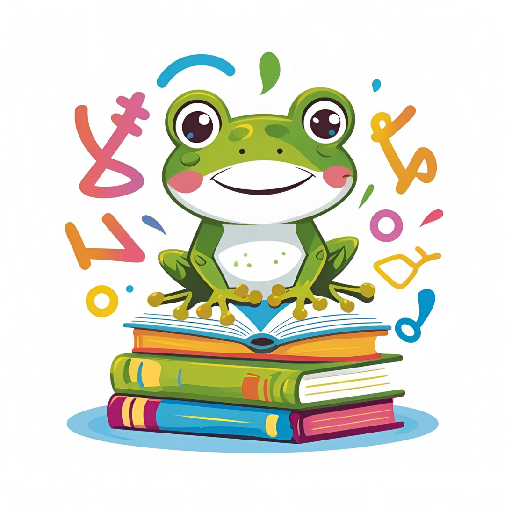

# 🐸 LangQuest

> **An AI-Powered Language Learning Desktop Application Built with Electron, React, and TypeScript**

LangQuest is a revolutionary language learning platform that makes mastering new languages fun, engaging, and effective. With our friendly frog mascot guiding you through interactive lessons, real-world scenarios, and AI-powered conversations, learning a new language has never been more enjoyable!



## ✨ Features

### 🧠 **AI-Generated Personalized Courses**
- Adaptive learning paths that adjust to your pace and learning style
- Focus on one word at a time for maximum retention
- Customized content based on your native language and target language

### 🎭 **Scene-Based Conversations**
- Practice real-world scenarios with AI voice agents
- Interactive conversations in restaurants, airports, meetings, and everyday situations
- Voice recognition and pronunciation feedback

### ⚡ **Bite-Sized Learning**
- Micro-lessons that fit into your busy schedule (5-10 minutes daily)
- Progress tracking with streaks and achievements
- Gamified learning experience with points and rewards

### 🌍 **30+ Languages Supported**
- Learn popular languages: Spanish, French, German, Italian, Portuguese
- Asian languages: Mandarin, Japanese, Korean, Hindi
- And many more languages to explore!

### 👥 **Community Features**
- Activity calendar to track your learning journey
- User profiles with progress visualization
- Streak tracking and achievement system

### 🎨 **Beautiful User Interface**
- Modern, clean design with smooth animations
- Dark/light theme support
- Responsive design that works on all screen sizes
- Friendly frog mascot for guidance and motivation

## 🛠️ Technology Stack

### **Frontend**
- **React 19** - Modern UI framework with hooks
- **TypeScript** - Type-safe development
- **Tailwind CSS** - Utility-first CSS framework
- **Vite** - Fast build tool and development server
- **React Router Dom** - Client-side routing
- **Zustand** - State management
- **React Query** - Server state management

### **Desktop Framework**
- **Electron** - Cross-platform desktop application framework
- **Electron Store** - Persistent data storage
- **Electron Builder** - Application packaging and distribution

### **UI Components**
- **Radix UI** - Accessible component primitives
- **Lucide React** - Beautiful icons
- **Sonner** - Toast notifications
- **React Hook Form** - Form handling
- **Recharts** - Data visualization
- **React Activity Calendar** - Activity tracking visualization

### **Additional Libraries**
- **Simple Keyboard** - Virtual keyboard component
- **Motion** - Smooth animations
- **Zod** - Schema validation
- **Date-fns** - Date utility functions

## 📦 Installation

### Prerequisites
- **Node.js** (v18 or higher)
- **npm** or **yarn** package manager

### Clone and Install
```bash
# Clone the repository
git clone https://github.com/LangQuest-App/LangQuest.git

# Navigate to project directory
cd LangQuest

# Install dependencies
npm install
```

## 🚀 Development

### Start Development Server
```bash
# Run both React and Electron in development mode
npm run dev

# Or run them separately:
npm run dev:react    # Start Vite development server
npm run dev:electron # Start Electron app
```

### Build for Production
```bash
# Build the application
npm run build

# Build and package for different platforms
npm run dist:win     # Windows (x64)
npm run dist:mac     # macOS (ARM64)
npm run dist:linux   # Linux (x64)
```

### Other Commands
```bash
npm run lint         # Run ESLint
npm run preview      # Preview production build
npm run transpile:electron # Compile TypeScript for Electron
```

## 📁 Project Structure

```
LangQuest/
├── src/
│   ├── electron/           # Electron main process files
│   │   ├── main.ts        # Main Electron process
│   │   ├── preload.ts     # Preload script for IPC
│   │   └── util.ts        # Utility functions
│   │
│   └── ui/                # React frontend
│       ├── components/    # React components
│       │   ├── Auth/      # Authentication components
│       │   ├── Buttons/   # Reusable button components
│       │   ├── Lessons/   # Lesson-related components
│       │   ├── Profile/   # User profile components
│       │   ├── Quiz/      # Practice quiz components
│       │   └── ui/        # Radix UI components
│       │
│       ├── hooks/         # Custom React hooks
│       ├── lib/           # Utilities and stores
│       │   ├── contextStores/ # Zustand state stores
│       │   └── types/     # TypeScript type definitions
│       │
│       ├── pages/         # Page components
│       ├── types/         # Global type definitions
│       └── utils/         # Utility functions
│
├── public/                # Static assets
│   ├── images/           # App images and icons
│   └── fonts/            # Custom fonts
│
├── dist-electron/        # Built Electron files
├── dist-react/          # Built React files
└── electron-builder.json # Electron Builder configuration
```

## 🎯 Key Features & Components

### Authentication System
- **Sign Up/Sign In** - Beautiful animated forms with form validation
- **User Management** - Persistent user data with Electron Store
- **Profile System** - User preferences and learning progress

### Learning Experience
- **Onboarding** - Interactive questionnaire to personalize learning
- **Lesson System** - AI-generated lessons based on user preferences
- **Scene Practice** - Real-world conversation scenarios
- **Progress Tracking** - Visual progress indicators and streak tracking

### Interactive Elements
- **Virtual Keyboard** - Multi-language keyboard support
- **Voice Recognition** - Practice pronunciation with AI feedback
- **Responsive Design** - Works seamlessly on all screen sizes

## 🔧 Configuration

### Electron Builder Configuration
The app is configured to build for multiple platforms:
- **Windows**: x64 architecture
- **macOS**: ARM64 (Apple Silicon) support
- **Linux**: x64 architecture

### TypeScript Configuration
- Separate TypeScript configs for Electron and React
- Strict type checking enabled
- Path aliases for clean imports

### Development Tools
- **ESLint** - Code linting with React and TypeScript rules
- **Prettier** - Code formatting (via ESLint integration)
- **Hot Reload** - Fast development with Vite HMR

## 🌟 User Journey

1. **Welcome Screen** - Beautiful landing page with animated frog mascot
2. **Authentication** - Sign up or sign in with elegant forms
3. **Onboarding** - Personalization questionnaire for learning preferences
4. **Dashboard** - Main hub with lessons, practice, and profile access
5. **Learning** - Interactive lessons with AI-generated content
6. **Practice** - Real-world scenarios and conversation practice
7. **Progress** - Track achievements, streaks, and learning statistics

## 🎨 Design Philosophy

LangQuest focuses on creating a **joyful and stress-free** learning experience:

- **Friendly Mascot** - Our frog companion guides users through their journey
- **Smooth Animations** - Delightful micro-interactions enhance user experience
- **Clean Interface** - Minimalist design reduces cognitive load
- **Gamification** - Points, streaks, and achievements maintain motivation
- **Accessibility** - Built with inclusive design principles

## 🤝 Contributing

We welcome contributions! Please follow these steps:

1. Fork the repository
2. Create a feature branch (`git checkout -b feature/amazing-feature`)
3. Commit your changes (`git commit -m 'Add amazing feature'`)
4. Push to the branch (`git push origin feature/amazing-feature`)
5. Open a Pull Request

### Development Guidelines
- Follow TypeScript best practices
- Use existing UI components from the design system
- Ensure responsive design
- Write meaningful commit messages
- Test your changes thoroughly

## 📄 License

This project is licensed under the MIT License - see the [LICENSE](LICENSE) file for details.

## 🙏 Acknowledgments

- **Hackathon Team** - Original developers
- **Radix UI** - For accessible component primitives
- **Lucide** - For beautiful icons
- **Electron Community** - For the amazing desktop framework
- **React Community** - For the robust frontend ecosystem

## 📞 Support

If you encounter any issues or have questions:

1. Check the [Issues](https://github.com/LangQuest-App/LangQuest/issues) page
2. Create a new issue with detailed description
3. Join our community discussions

---

**Happy Learning! 🐸📚**

*Start your language learning adventure with LangQuest today!*
